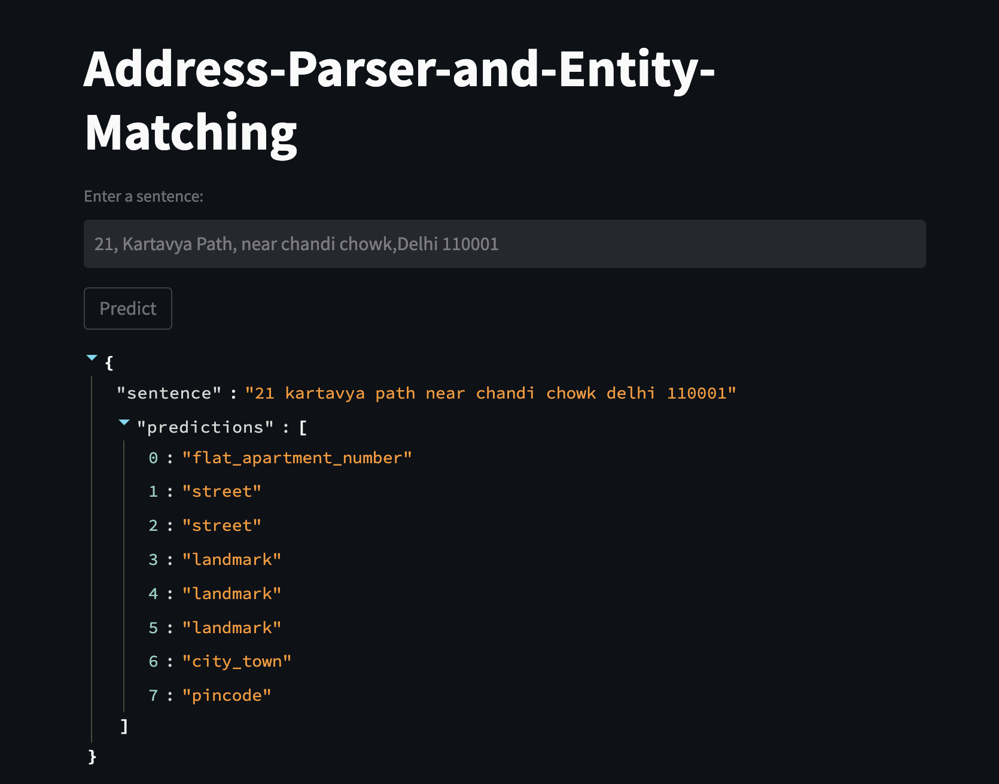

# Indian-Address-Parser-and-Entity-Matching

  
## Overview
This project implements a custom Named Entity Recognition (NER) system for address parsing functionality by fine tuning DistilBERT model. The model is trained on a dataset containing addresses and associated labels for Named Entities.

## Dataset
Unfortunately, I cannot provide the dataset used in this project due to privacy and confidentiality reasons. However, the dataset contains address texts along with labels for categories given below.

address : 201, Main Street, Pleasantville, New York, 123456

labels  : flat_apartment_number street street sub_locality city_town city_town pincode

#### The dataset contains the following Named Entity tags:

area_locality_name: 0  
city_town: 1  
flat_apartment_number: 2  
landmark: 3  
society_name: 4  
street: 5  
sub_locality: 6  
pincode: 7

The dataset is split into three subsets:

- Training set: Used to train the model.
- Development set: Used for model validation during training.
- Test set: Used to evaluate the final model performance.

## Model Architecture
The NER system is based on the DistilBERT architecture from Hugging Face's Transformers library. The model is fine-tuned for token classification with a specified number of output labels corresponding to the unique Named Entity tags present in the dataset.

## Training
The training loop is implemented to train the model on the training dataset. The training loop includes evaluation on the development set to monitor model performance and prevent overfitting. We use the Stochastic Gradient Descent (SGD) optimizer with a specified learning rate for optimization.

## Evaluation
After training, the model is evaluated on the test set to assess its performance metrics, including accuracy, F1 score, precision, and recall. These metrics provide insights into the model's ability to correctly identify Named Entities and parse addresses.

## Usage
To use the trained model for address parsing and Named Entity Recognition:

1. Ensure all required libraries are installed (listed in requirements.txt).
2. Load the model and metadata from the saved file (distilbert_ner_model_meta.pth).
3. Use the model to predict Named Entities and parse addresses by providing input text.

## Images

This image shows the output of the model for a sample address text. The model correctly identifies the Named Entities and parses the address into structured information.
